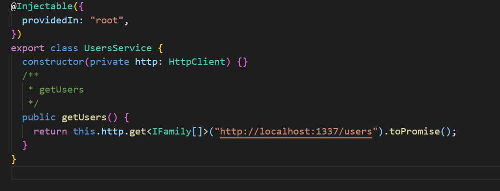
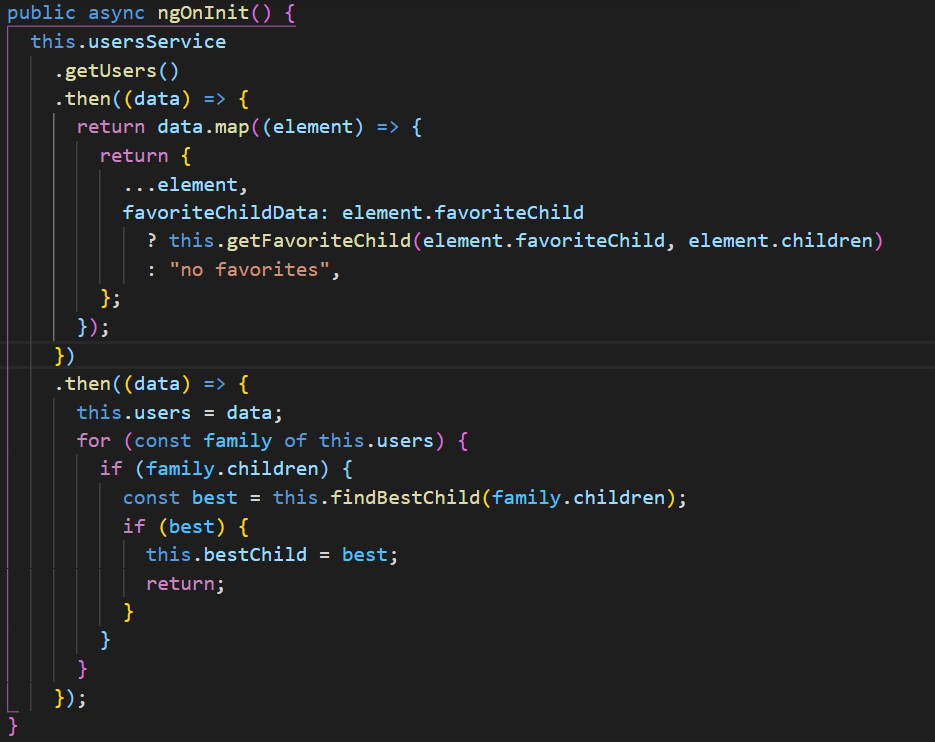
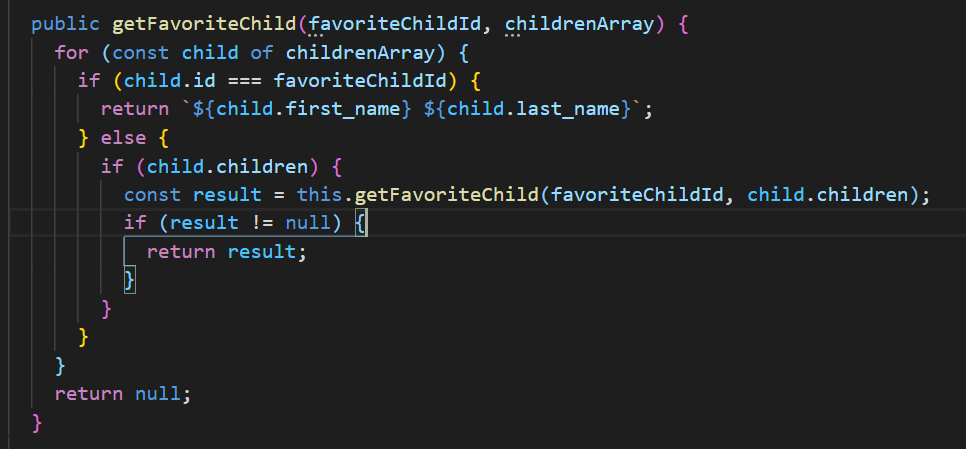
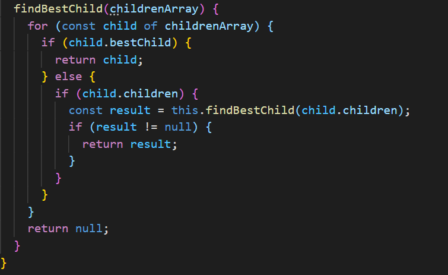

<h1 align="center">
  Family tree recursive functions 
</h1>

<h4 align="center">
  code solution for working with nested objects  and recursive function using angular.
</h4>

# Objectives

- Retrieve the list of users with a call to the API
- Display the list of families in the table
- In a column display the first and last name of favoriteChild of each family
- Find and display the bestChild

<br/><br/>

# Code snippets

- Retrieving the list of users with a call to the API
  <br/><br/>
  
- adding the new favorite child object to fetched data using spread operator
  <br/><br/>
  
- searching and finding the first and last name of the favoriteChild of each family
  <br/><br/>
  
- Finding the bestChild
  <br/><br/>
  

# Getting started

Execute the command `npm install` at the root of the repo `recursive_tree` **AND** in the folder `front`

```console
~/recursive_tree $ npm install
~/recursive_tree/front $ npm install
```

Start the server using the command at the root of the repo

```console
~/recursive_tree $ npm start
```

Start the application using the command in the folder fullstack

```console
~/recursive_tree/front $ npm start
```

<br/><br/>
In the folder `src/app` you will find the `angular` application. \
In the folder `src/app/providers` you will find `users.service.ts` where there is a method to query the server on this endpoint `http://localhost:1337/users` and retrieve users and then process them with the files `src/app/app.component.[html/css/ts]`

<br/><br/>

# Ressources

### **users**

`GET http://localhost:1337/users` \
**Response**:

```json
[
    {
        "id": 1,
        "family_name": "Marot",
        "email": "jmorot0@ed.gov",
        "picture": "https://picsum.photos/id/454/24/24",
        "favoriteChild": 51,
        "children": [
            {
                "id": 51,
                "first_name": "Helene",
                "last_name": "Marot",
                "email": "hkearf@gizmodo.com",
                "picture": "https://picsum.photos/id/455/24/24",
                "children": [ ... ]
            }
        ]
    },
    ...
]
```
